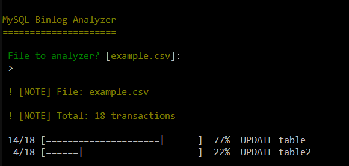

# MySQL Binlog Analyzer

This application show usage from binlog extract files.

This use regular expressions to show the usage.

(c) This service is created using Symfony Command

## How to run

Using command line:

```
php index.php analyzer
```

Optional set filename on call command:

```
php index.php analyzer file.csv
```

## Preview




## Contribute

Contributions are always welcome!

## License

[](https://creativecommons.org/publicdomain/zero/1.0/)

To the extent possible under law, [VitorGGA](https://vitorgga.com) has waived all copyright and related or neighboring rights to this work.